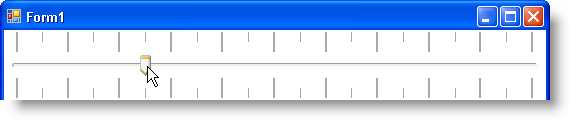

////

|metadata|
{
    "name": "wintrackbar-changing-the-look-location-and-frequency-of-tickmarks",
    "controlName": ["WinTrackBar"],
    "tags": ["How Do I","Navigation","Styling"],
    "guid": "{6A9ED20C-A333-4E5C-9368-F9DA9ADAA5B3}",  
    "buildFlags": [],
    "createdOn": "2008-11-01T12:50:01Z"
}
|metadata|
////

= Changing the Look, Location, and Frequency of Tickmarks

Tickmarks are a great way to help your end user figure out exactly how many values you may have in one TrackBar. You can set the minimum and maximum values of WinTrackBar through the  pick:[win-forms="link:{ApiPlatform}win.ultrawineditors{ApiVersion}~infragistics.win.ultrawineditors.ultratrackbar~minvalue.html[MinValue]"]  and  pick:[win-forms="link:{ApiPlatform}win.ultrawineditors{ApiVersion}~infragistics.win.ultrawineditors.ultratrackbar~maxvalue.html[MaxValue]"]  properties, respectively. Setting the minimum value to 0 and maximum value to 100 could imply a percentage type value. In a group of three TrackBars, setting the minimum value of each to 0 and the maximum value of each to 255 might imply RGB color values. If you don't display your Tickmarks properly, you may end up confusing your end user.

There are several ways in which you can change the appearance, location, and frequency of two sets of Tickmarks: Major Tickmarks and Minor Tickmarks. As their names imply, Major Tickmarks are meant to demonstrate larger spans in value as the Minor Tickmarks display shorter spans. Naturally, you'll want the Major Tickmarks to stand out a little more than the Minor Tickmarks. To accomplish that, you'll want to change both the  pick:[win-forms="link:{ApiPlatform}win{ApiVersion}~infragistics.win.ultrawineditors.tickmarksettingsbase~extent.html[Extent]"]  and  pick:[win-forms="link:{ApiPlatform}win{ApiVersion}~infragistics.win.ultrawineditors.tickmarksettingsbase~thickness.html[Thickness]"]  properties. Extent determines how far the Tickmark extends from the side of the control. Thickness determines the Tickmarks width (the weight of the line) in pixels.

Using the above mentioned properties, you can turn WinTrackBar into a precise measuring device that your end users will understand at first glance. Use the following code sample to transform WinTrackBar into a ruler.

*In Visual Basic:*

----
'In the standard ViewStyle, minor tickmarks display
'by default, major tickmarks do not.
Me.UltraTrackBar1.TickmarkSettingsMajor.Visible = _
    Infragistics.Win.DefaultableBoolean.True
'Extend the length of the major tickmarks to twice
'the length of the minor tickmarks.
Me.UltraTrackBar1.TickmarkSettingsMajor.Extent = 20
Me.UltraTrackBar1.TickmarkSettingsMinor.Extent = 10
Me.UltraTrackBar1.TickmarkSettingsMinor.TrackOffset += 10
'There will be twice as many minor tickmarks as there 
'will be major tickmarks.
Me.UltraTrackBar1.TickmarkSettingsMajor.Frequency = 10
Me.UltraTrackBar1.TickmarkSettingsMinor.Frequency = 5
'Display major and minor tickmarks on both the top and
'bottom of WinTrackBar. Note that if the orientation
'were vertical, 'Both' would mean left and right rather
'than top and bottom.
Me.UltraTrackBar1.TickmarkSettingsMajor.Location = _
    Infragistics.Win.UltraWinEditors.TickmarkLocation.Both
Me.UltraTrackBar1.TickmarkSettingsMinor.Location = _
    Infragistics.Win.UltraWinEditors.TickmarkLocation.Both
'Make the major tickmarks a little thicker than the
'minor tickmarks.
Me.UltraTrackBar1.TickmarkSettingsMajor.Thickness = 2
Me.UltraTrackBar1.TickmarkSettingsMinor.Thickness = 1
----

*In C#:*

----
//In the standard ViewStyle, minor tickmarks display
//by default, major tickmarks do not.
this.ultraTrackBar1.TickmarkSettingsMajor.Visible = 
    Infragistics.Win.DefaultableBoolean.True;
//Extend the length of the major tickmarks to twice
//the length of the minor tickmarks.
this.ultraTrackBar1.TickmarkSettingsMajor.Extent = 20;
this.ultraTrackBar1.TickmarkSettingsMinor.Extent = 10;
this.ultraTrackBar1.TickmarkSettingsMinor.TrackOffset += 10;
//There will be twice as many minor tickmarks as there 
//will be major tickmarks.
this.ultraTrackBar1.TickmarkSettingsMajor.Frequency = 10;
this.ultraTrackBar1.TickmarkSettingsMinor.Frequency = 5;
//Display major and minor tickmarks on both the top and
//bottom of WinTrackBar. Note that if the orientation
//were vertical, 'Both' would mean left and right rather
//than top and bottom.
this.ultraTrackBar1.TickmarkSettingsMajor.Location = 
    Infragistics.Win.UltraWinEditors.TickmarkLocation.Both;
this.ultraTrackBar1.TickmarkSettingsMinor.Location =
    Infragistics.Win.UltraWinEditors.TickmarkLocation.Both;
//Make the major tickmarks a little thicker than the
//minor tickmarks.
this.ultraTrackBar1.TickmarkSettingsMajor.Thickness = 2;
this.ultraTrackBar1.TickmarkSettingsMinor.Thickness = 1;
----