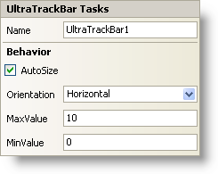

////

|metadata|
{
    "name": "wintrackbar-smart-tag",
    "controlName": ["WinTrackBar"],
    "tags": ["API","Design Environment"],
    "guid": "{E9C55801-1FD2-4818-9C4E-7172CD5616C3}",  
    "buildFlags": [],
    "createdOn": "0001-01-01T00:00:00Z"
}
|metadata|
////

= WinTrackBar Smart Tag

In Visual Studio 2005 (.NET Framework 2.0), each Infragistics Windows Forms control/component is equipped with a Smart Tag. By simply selecting the control/component, a Smart Tag anchor appears. When you click this anchor, a pop-up panel appears, providing you with quick and easy access to the most common properties and settings of the control/component.

The WinTrackBar™ Smart Tag contains the name of the component, as well as the following sections:

* Behavior -- Provides easy access to properties that govern how the control behaves on the form.

See below for a description of the item (e.g., field, drop-down list, checkbox) in each section, as well as the item's corresponding property in the properties grid.

[options="header", cols="a,a,a"]
|====
|Behavior|Description|Corresponding Property

|AutoSize
|Automatically resizes the TrackBar depending on the Orientation value.
| link:{ApiPlatform}win.ultrawineditors{ApiVersion}~infragistics.win.ultrawineditors.ultratrackbar~autosize.html[AutoSize]

|Orientation
|Configures WinTrackBar to sit vertically or horizontally on the form.
| link:{ApiPlatform}win.ultrawineditors{ApiVersion}~infragistics.win.ultrawineditors.ultratrackbar~orientation.html[Orientation]

|MaxValue
|The maximum value allowed on the TrackBar
| link:{ApiPlatform}win.ultrawineditors{ApiVersion}~infragistics.win.ultrawineditors.ultratrackbar~maxvalue.html[MaxValue]

|MinValue
|The minimum value allowed on the TrackBar
| link:{ApiPlatform}win.ultrawineditors{ApiVersion}~infragistics.win.ultrawineditors.ultratrackbar~minvalue.html[MinValue]

|====