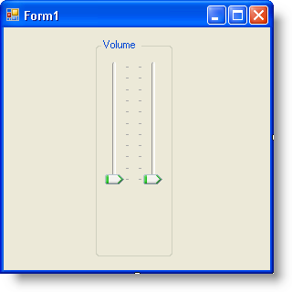
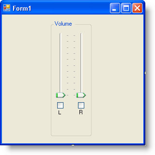
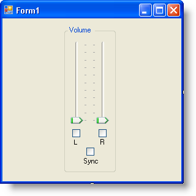
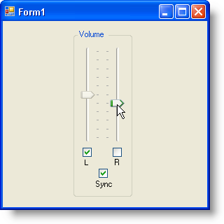

////

|metadata|
{
    "name": "wintrackbar-synchronizing-two-wintrackbar-controls",
    "controlName": ["WinTrackBar"],
    "tags": ["How Do I","Navigation"],
    "guid": "{00EB8C50-2187-43E6-A57C-F89E4C99F250}",  
    "buildFlags": [],
    "createdOn": "2008-10-01T17:11:39Z"
}
|metadata|
////

= Synchronizing Two WinTrackBar Controls

== Before You Begin

Because of the diverse role WinTrackBar can play in your application, you can use it in almost any situation that requires your end user to set incremental values. One very familiar role that TrackBar controls in general play is the volume control. Using two WinTrackBar controls side-by-side, you can create your own stereo fader to control the volume of a multimedia application. Normally, this type of volume control also includes a mute feature to mute both stereo channels, as well as a sync feature to synchronize the two faders.

== What You Will Accomplish

You will create a stereo volume control consisting of two WinTrackBar controls as the faders, two WinCheckEditor controls as mute check boxes, and one WinCheckEditor control as a synchronization check box. Because manipulating your computer's volume requires you to write interop code, doing so is beyond the scope of this topic and we will only be concerned with the user interface.

== Follow these Steps

[start=1]
. *Setup the WinTrackBar controls to act as faders.*

.. Drag a WinGroupBox control onto the form and in the properties window, set its Text property to "Volume".
.. Drag two WinTrackBar controls into WinGroupBox and set their  pick:[win-forms="link:infragistics4.win.ultrawineditors.v{ProductVersion}~infragistics.win.ultrawineditors.ultratrackbar~orientation.html[Orientation]"]  property to Vertical.
.. Set the right WinTrackBar's  pick:[win-forms="link:infragistics4.win.v{ProductVersion}~infragistics.win.ultrawineditors.tickmarksettingsbase~location.html[TickmarkSettingsMinor.Location]"]  property to TopOrLeft. Your form should now look similar to the following screen shot.

[start=2]
. *Setup two WinCheckEditor controls to act as mutes for the faders.*

.. Drag two WinCheckEditor controls into WinGroupBox, one directly below each WinTrackBar.
.. Remove the text from each WinCheckEditor's Text property.
.. Drag two WinLabel controls into WinGroupBox, one directly below each WinCheckEditor.
.. Set the Text property of the left WinLabel to 'L' and the right WinLabel to 'R'. Your form should now look similar to the following screen shot.

[start=3]
. *Setup another WinCheckEditor control to synchronize the two faders.*

.. Drag one more WinCheckEditor control into WinGroupBox and place it below the two WinCheckEditors already placed on the form.
.. Remove the text from the third WinCheckEditor's Text property.
.. Drag another WinLabel into WinGroupBox and place it directly below the third WinCheckEditor control.
.. Set the Text property of the third WinLabel control to 'Sync'. Your form should now look similar to the following screen shot.

[start=4]
. *Mute the faders by Enabling/Disabling the two WinTrackBar controls.*

When the end user selects the check box, they will essentially be muting that particular stereo channel . Therefore, you can emulate this function by disabling the TrackBar so the end user will know it's muted. You can do this by simply setting the Enabled property to False. In each WinCheckEditor's  pick:[win-forms="link:infragistics4.win.ultrawineditors.v{ProductVersion}~infragistics.win.ultrawineditors.ultracheckeditor~checkedchanged_ev.html[CheckedChanged]"]  event (easily set up by double-clicking the check box in the designer), toggle the respective WinTrackBar Enabled property.

*In Visual Basic:*

----
Private Sub UltraCheckEditor1_CheckedChanged(ByVal sender As System.Object, _
  ByVal e As System.EventArgs) Handles UltraCheckEditor1.CheckedChanged
    ' Toggle the Enabled property for the left WinTrackBar. 
    Me.UltraTrackBar1.Enabled = Not Me.UltraTrackBar1.Enabled
End Sub
Private Sub UltraCheckEditor2_CheckedChanged(ByVal sender As System.Object, _
  ByVal e As System.EventArgs) Handles UltraCheckEditor2.CheckedChanged
    ' Toggle the Enabled property for the right WinTrackBar.
    Me.UltraTrackBar2.Enabled = Not Me.UltraTrackBar2.Enabled
End Sub
----

*In C#:*

----
private void ultraCheckEditor1_CheckedChanged(object sender, EventArgs e)
{
	// Toggle the Enabled property for the left WinTrackBar. 
	this.ultraTrackBar1.Enabled = !this.ultraTrackBar1.Enabled;
}
private void ultraCheckEditor2_CheckedChanged(object sender, EventArgs e)
{
	// Toggle the Enabled property for the right WinTrackBar.
	this.ultraTrackBar2.Enabled = !this.ultraTrackBar2.Enabled;
}
----

[start=5]
. *Allow the end user to synchronize the two WinTrackBar controls.*

In most audio applications, when using stereo tracks in a mixer, the application usually has an option to synchronize the two faders to keep them equalized. The third check box that you added to the form will take care of switching on and off the synchronization. First, you will need a Boolean value that will maintain the state of whether or not the two faders are synchronized. Second, you will need to toggle that Boolean value whenever the end user selects or deselects the check box. The actual synchronization of the two faders will take place in the next step.

*In Visual Basic:*

----
Dim synced As Boolean = False
Private Sub UltraCheckEditor3_CheckedChanged(ByVal sender As System.Object, _
  ByVal e As System.EventArgs) Handles UltraCheckEditor3.CheckedChanged
    Me.synced = Not Me.synced
End Sub
----

*In C#:*

----
bool synced = false;
private void ultraCheckEditor3_CheckedChanged(object sender, EventArgs e)
{
	this.synced = !this.synced;
}
----

[start=6]
. *Synchronize the two WinTrackBar controls.*

In order to synchronize the WinTrackBar controls, you will be setting the  pick:[win-forms="link:infragistics4.win.ultrawineditors.v{ProductVersion}~infragistics.win.ultrawineditors.ultratrackbar~value.html[Value]"]  of one WinTrackBar control in the  pick:[win-forms="link:infragistics4.win.ultrawineditors.v{ProductVersion}~infragistics.win.ultrawineditors.ultratrackbar~valuechanged_ev.html[ValueChanged]"]  event of the other WinTrackBar control. Before you set the Value, you will need to test for two conditions:

** Are the two WinTrackBar's synced?
** Is the other WinTrackBar Enabled?

If both of these conditions are met, set the value of the other WinTrackBar control to the Value of the WinTrackBar control currently being changed.

*In Visual Basic:*

----
Private Sub UltraTrackBar1_ValueChanged(ByVal sender As System.Object, _
  ByVal e As System.EventArgs) Handles UltraTrackBar1.ValueChanged
    If Me.synced AndAlso Me.UltraTrackBar2.Enabled Then
        Me.UltraTrackBar2.Value = Me.UltraTrackBar1.Value
    End If
End Sub
Private Sub UltraTrackBar2_ValueChanged(ByVal sender As System.Object, _
  ByVal e As System.EventArgs) Handles UltraTrackBar2.ValueChanged
    If Me.synced AndAlso Me.UltraTrackBar1.Enabled Then
        Me.UltraTrackBar1.Value = Me.UltraTrackBar2.Value
    End If
End Sub
----

*In C#:*

----
private void ultraTrackBar1_ValueChanged(object sender, EventArgs e)
{
	if (synced && this.ultraTrackBar2.Enabled) 
		this.ultraTrackBar2.Value = this.ultraTrackBar1.Value;
}
private void ultraTrackBar2_ValueChanged(object sender, EventArgs e)
{
	if (synced && this.ultraTrackBar1.Enabled) 
		this.ultraTrackBar1.Value = this.ultraTrackBar2.Value;
}
----

[start=7]
. *Run the application.*

Run the application and move the faders up and down, they will move independently of each other. Select the Sync check box and move the faders again; the faders now move with each other. Now select the left mute check box and move the right fader; the left fader remains in place.

