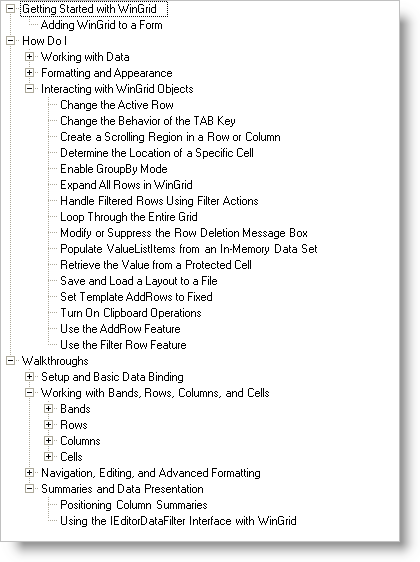
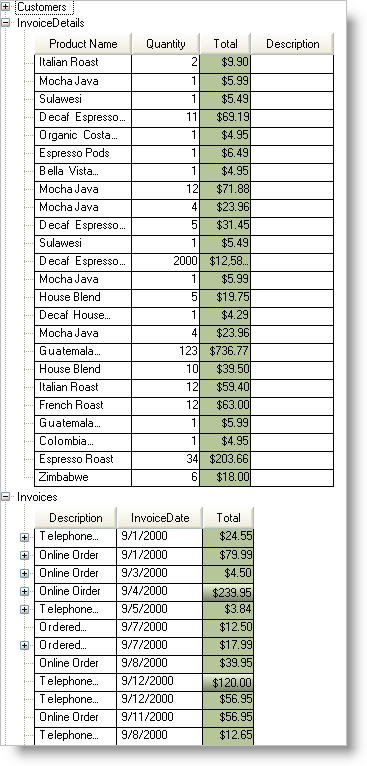

////

|metadata|
{
    "name": "wintree-about-wintree",
    "controlName": ["WinTree"],
    "tags": [],
    "guid": "{176AA872-820D-4EFD-A07F-A170060384CC}",  
    "buildFlags": [],
    "createdOn": "0001-01-01T00:00:00Z"
}
|metadata|
////

= About WinTree

WinTree™ is a Windows Forms control that allows for navigation and structure in any Windows Forms application or project.

* Appearance Support -- Full appearance support including alpha-blending, gradients, images, etc.
* Node Editing -- You can manage node editing for your end user.
* Multi-Column Grid -- the Infragistics Windows Forms 2005 Volume 2 release of the WinTree was able to display columns and cells similar to the WinGrid control.
* ViewStyle -- Allows you to toggle between having a standard tree, to a multi-column tree, to a free-form tree.
* Cell Editing -- Starting in the Infragistics Windows Forms 2005 Volume 3 release you could edit the cells when the WinTree was data bound and had multiple columns.

