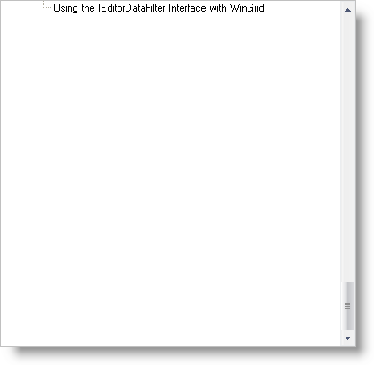
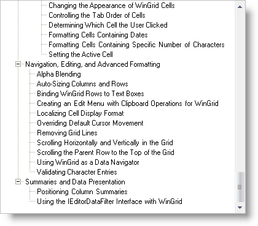

////

|metadata|
{
    "name": "wintree-change-the-vertical-scrolling-behavior-of-a-scrollbar",
    "controlName": ["WinTree"],
    "tags": [],
    "guid": "{9DD272BF-7630-403E-B27C-76A9012E37B9}",  
    "buildFlags": [],
    "createdOn": "0001-01-01T00:00:00Z"
}
|metadata|
////

= Change the Vertical Scrolling Behavior of a Scrollbar

There are two settings that control the WinTree's™ vertical scrolling behavior. These settings are determined by the  pick:[win-forms="link:{ApiPlatform}win.ultrawintree{ApiVersion}~infragistics.win.ultrawintree.ultratree~scrollbounds.html[ScrollBounds]"] property. Setting the ScrollBounds property to ScrollToLastItem (the default setting) will scroll the tree all the way down so only the last node is visible. Setting the ScrollBounds property to ScrollToFill will scroll the tree in such a way that the last node is at the bottom of the control's viewable area.

The following code demonstrates how to set the ScrollBounds property to ScrollToFill.

*In Visual Basic:*

----
Imports Infragistics.Win.UltraWinTree
...
Private Sub _Load(ByVal sender As  System.Object, ByVal e As System.EventArgs) Handles MyBase.Load
	Me.UltraTree1.ScrollBounds = ScrollBounds.ScrollToFill
End Sub
----

*In C#:*

----
using Infragistics.Win.UltraWinTree;
...
private void HowtoChangetheVerticalScrollingBehavioroftheScrollbar_Load(
  object sender, EventArgs e)
{
	this.ultraTree1.ScrollBounds = ScrollBounds.ScrollToFill;
}
----

== ScrollToLastItem

== ScrollToFill

