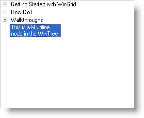

////

|metadata|
{
    "name": "wintree-display-multiple-lines-of-text-in-nodes",
    "controlName": ["WinTree"],
    "tags": ["How Do I"],
    "guid": "{A04D8569-86C6-48E2-BBA0-F313A01D1641}",  
    "buildFlags": [],
    "createdOn": "2005-07-07T00:00:00Z"
}
|metadata|
////

= Display Multiple Lines of Text in Nodes

Starting with Version 3 of WinTree™, the functionality for editing tree nodes has been significantly enhanced. Tree node editing is now handled by the Embeddable Editor technology of the Infragistics.Win assembly. To complement the enhanced editing capabilities, tree nodes have also gained the ability to display multiple lines of text.

The primary property used to toggle the display of multi-line text in a node is the MultiLine property of the Override object. Set this property to True to enable multi-line text in the node(s) affected by the Override. Other properties which may prove useful when working with multi-line text include MaxLabelHeight and MaxLabelWidth, also of the Override object. MaxLabelWidth in particular determines where the multi-line text will wrap.

Use the following code to enable multi-line text at the grid level:

*In Visual Basic:*

----
Imports Infragistics.Win
...
Me.UltraTree1.Override.Multiline = DefaultableBoolean.True
----

*In C#:*

----
using Infragistics.Win;
...
this.ultraTree1.Override.Multiline = DefaultableBoolean.True;
----

You can also use the Override of a single node to enable multi-line text just for that node. For example:

*In Visual Basic:*

----
Imports Infragistics.Win
...
Me.UltraTree1.Nodes(2).Override.Multiline = DefaultableBoolean.True
----

*In C#:*

----
using Infragistics.Win;
...
this.ultraTree1.Nodes[2].Override.Multiline = DefaultableBoolean.True;
----