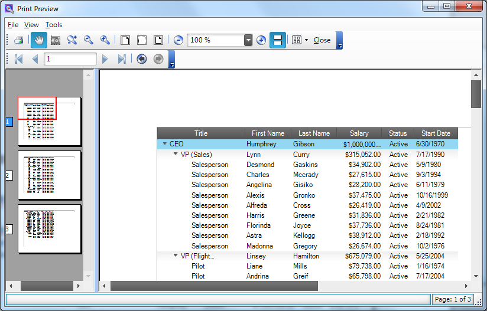

////

|metadata|
{
    "name": "wintree-printing-wintree",
    "controlName": [],
    "tags": [],
    "guid": "428719b7-839f-49d5-9621-35cc4bed4537",  
    "buildFlags": [],
    "createdOn": "2013-09-15T14:06:37.9277011Z"
}
|metadata|
////

= Printing WinTree

== Topic Overview

=== Purpose

This topic provides a conceptual overview of link:{ApiPlatform}win.ultrawintree{ApiVersion}~infragistics.win.ultrawintree.ultratree_members.html[UltraTree]™ printing functionality. Due to the similarity to  _WinGrid™_   printing functionality, read about  _WinGrid_   printing in the <<_Ref364014173,Required background>> section is recommended.

[[_Ref364014173]]

=== Required background

The following topic is a prerequisite to understanding this topic:

[options="header", cols="a,a"]
|====
|Topic|Purpose

| link:wingrid-printing.html[Printing]
|_WinGrid_ offers several printing options from exporting your grid to a Microsoft® Excel® file or PDF document, to sending your grid to a print preview dialog or printer.

|====

=== In this topic

This topic contains the following sections:

* <<_Ref364014499,Overview>>
* <<_Ref364014507,Code Example>>
* <<_Ref364014514,Related Content>>

[[_Ref364014499]]
== Overview

=== WinTree Printing Summary

The  _WinTree_   printing feature is intended to provide print preview and print functionalities. The  _WinTree_   can be viewed and printed in any of its supported view styles, for example,  _Standard_  ,  _OutlookExpress_  ,  _Grid_   and  _FreeForm_  .

The following screenshot illustrates the print preview of the  _WinTree_   (In  _OutlookExpress_   view style).

[[_Ref364014507]]

=== Code Example

This code example requires a project with a  _WinTree_   control, if not, refer to link:wintree.html[WinTree] help documentation before continuing the  _WinTree_   for print preview or print configuration.

The following code example demonstrates the  _WinTree_   for print preview on a button click event.

*In C#:*

[source,csharp]
----
using (var printDoc = new UltraTreePrintDocument())
{
    printDoc.Tree = _ultraTree1;
    using (var previewDialog = new UltraPrintPreviewDialog())
    {
        previewDialog.Document = printDoc;
        previewDialog.ShowDialog(this);
    }
}
----

*In Visual Basic:*

[source,vb]
----
Using printDoc As UltraTreePrintDocument = New UltraTreePrintDocument()
printDoc.Tree = _ultraTree1
       Using previewDialog As UltraPrintPreviewDialog = New UltraPrintPreviewDialog()
             previewDialog.Document = printDoc
              previewDialog.ShowDialog(Me)
       End Using
End Using
----

Call the  _Print_   method of link:{ApiPlatform}win.ultrawintree{ApiVersion}~infragistics.win.ultrawintree.ultratreeprintdocument_members.html[UltraTreePrintDocument] instead of opening the print preview dialog for printing the  _WinTree_  .

*In C#:*

[source,csharp]
----
using (UltraTreePrintDocument printDoc = new UltraTreePrintDocument())
{
    printDoc.Tree = ultraTree1;
    printDoc.Print();
}
----

*In Visual Basic:*

[source,vb]
----
Using printDoc As New UltraTreePrintDocument()
      printDoc.Tree = ultraTree1
      printDoc.Print()
End Using
----

[[_Ref364014514]]
== Related Content

=== Topics

The following topic provides additional information related to this topic.

[options="header", cols="a,a"]
|====
|Topic|Purpose

| link:wintree.html[WinTree]
|This section contains valuable information about _WinTree_, ranging from what the control does and why you would want to use it in your application, to step-by-step procedures on how to accomplish a common task using the control.

|====