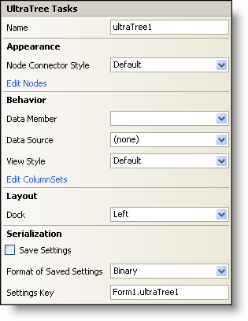

////

|metadata|
{
    "name": "wintree-smart-tag",
    "controlName": ["WinTree"],
    "tags": [],
    "guid": "{F8780BC6-F872-40A8-9C2A-3FE00EB3932C}",  
    "buildFlags": [],
    "createdOn": "0001-01-01T00:00:00Z"
}
|metadata|
////

= WinTree Smart Tag

In Visual Studio 2005 (.NET Framework 2.0), each Infragistics Windows Forms control/component is equipped with a Smart Tag. By simply selecting the control/component, a Smart Tag anchor appears. When you click this anchor, a pop-up panel appears, providing you with quick and easy access to the most common properties and settings of the control/component.

The WinTree™ Smart Tag contains the name of the control, as well as the following sections:

* Appearance -- Provides common tasks involving the appearance, look, and feel of the control.
* Behavior -- Provides easy access to properties that govern how the control behaves on the form.
* Layout -- Offers properties that will determine where and how the control is placed on the form.
* Serialization -- Provides quick access to properties used in the IPersistComponentSettings interface.

See below for a description of the item (e.g., field, drop-down list, checkbox) in each section, as well as the item's corresponding property in the properties grid.

[options="header", cols="a,a,a"]
|====
|Appearance|Description|Corresponding Property

|Node Connector Style
|Each parent, child, and sibling node is visually connected by node connectors which can be styled dotted, dashed, solid, etc... Select which style you would like to use by clicking the drop-down arrow and selecting a style.
| pick:[win-forms="link:{ApiPlatform}win.ultrawintree{ApiVersion}~infragistics.win.ultrawintree.ultratree~nodeconnectorstyle.html[NodeConnectorStyle]"] 

|Edit Nodes
|Clicking Edit Nodes brings up the UltraWinTree node editor. Here you can add, delete, or edit Root, Child, and Sibling nodes.
| pick:[win-forms="link:{ApiPlatform}win.ultrawintree{ApiVersion}~infragistics.win.ultrawintree.ultratree~nodes.html[Nodes]"] 

|====

[options="header", cols="a,a,a"]
|====
|Behavior|Description|Corresponding Property

|Data Member
|Once you have selected a valid data source, you can select all available data members from this drop-down.
| pick:[win-forms="link:{ApiPlatform}win.ultrawintree{ApiVersion}~infragistics.win.ultrawintree.ultratree~datamember.html[DataMember]"] 

|Data Source
|Click the drop-down and all available data sources in your project will be displayed. If you do not have a data source set up, you can select, "Add Project Data Source..." to create one.
| pick:[win-forms="link:{ApiPlatform}win.ultrawintree{ApiVersion}~infragistics.win.ultrawintree.ultratree~datasource.html[DataSource]"] 

|View Style
|Change the style of the WinTree to make it look like Outlook Express, the grid, free form, and others.
| pick:[win-forms="link:{ApiPlatform}win.ultrawintree{ApiVersion}~infragistics.win.ultrawintree.ultratree~viewstyle.html[ViewStyle]"] 

|Edit ColumnSets
|Clicking on Edit ColumnSets will open the UltraTreeColumnSet collection editor.
| pick:[win-forms="link:{ApiPlatform}win.ultrawintree{ApiVersion}~infragistics.win.ultrawintree.ultratreecolumnsettings~columnsets.html[ColumnSets]"] 

|====

[options="header", cols="a,a,a"]
|====
|Layout|Description|Corresponding Property

|Dock
|Choose to dock the control to the top, right, bottom, left, full, or none.
|Dock

|====

[options="header", cols="a,a,a"]
|====
|Serialization|Description|Corresponding Property

|Save Settings
|If you select this checkbox, the component will automatically load/save its property settings with the application's settings.
| pick:[win-forms="link:{ApiPlatform}win.ultrawintree{ApiVersion}~infragistics.win.ultrawintree.ultratree~savesettings.html[SaveSettings]"] 

|Format of Saved Settings
|The component can save its settings in either binary or XML format.
| pick:[win-forms="link:{ApiPlatform}win.ultrawintree{ApiVersion}~infragistics.win.ultrawintree.ultratree~savesettingsformat.html[SaveSettingsFormat]"] 

|Settings Key
|You can specify the settings key that will be used to uniquely identify the settings' values that will be loaded/saved. By default, Visual Studio 2005 sets the settings key value based on the name of the containing form/control and the name of the component.
| pick:[win-forms="link:{ApiPlatform}win.ultrawintree{ApiVersion}~infragistics.win.ultrawintree.ultratree~settingskey.html[SettingsKey]"] 

|====