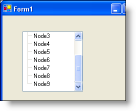

////

|metadata|
{
    "name": "wintree-vertical-scrolling-whats-new-2005-3",
    "controlName": [],
    "tags": [],
    "guid": "{41436EEC-734B-4459-9C55-0218D28066BF}",  
    "buildFlags": [],
    "createdOn": "0001-01-01T00:00:00Z"
}
|metadata|
////

= Vertical Scrolling

A new *ScrollBounds* property describes the vertical scrolling behavior for the WinTree™ control.

*ScrollToLastItem* -- vertical scrolling behavior is the same as it was in previous versions of the control, that is, the control can be scrolled until the last visible node is the topmost node.

*ScrollToFill* -- the vertical scrolling range is restricted so as to prevent scrolling past the point where the last visible node has been fully brought into view.

== Related Topic

link:wintree-change-the-vertical-scrolling-behavior-of-a-scrollbar.html[Change the Vertical Scrolling Behavior of a Scrollbar]