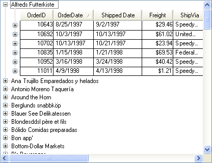

////

|metadata|
{
    "name": "wintree-whats-new-2005-2",
    "controlName": [],
    "tags": [],
    "guid": "{EDD2A805-2847-4FB3-AAB0-C7FCC23E718D}",  
    "buildFlags": [],
    "createdOn": "0001-01-01T00:00:00Z"
}
|metadata|
////

= WinTree 2005.2

== Multi-Column Support

The WinTree™ now supports the ability to display multiple columns of data. The  pick:[win-forms="link:{ApiPlatform}win.ultrawintree{ApiVersion}~infragistics.win.ultrawintree.ultratree~viewstyle.html[ViewStyle]"]  determines how the columns are displayed and includes the following three column styles. For more information on the view styles, see link:wintree-styles-of-wintree.html[Styles of WinTree].

=== Outlook Express Style

When set to OutlookExpress, a single set of column headers is displayed at the top of the control based on the  pick:[win-forms="link:{ApiPlatform}win.ultrawintree{ApiVersion}~infragistics.win.ultrawintree.ultratreecolumnsettings~rootcolumnset.html[RootColumnSet]"]  property. All nodes display their cell values within these columns. This style is commonly used when the entire tree will display homogenous data although it is possible to assign different columnset for nodes and indicate which column in the root columnset, the column should be displayed within.

=== Grid Style

When set to Grid, column headers are displayed at the top of each nodes collection. This would commonly be used when the nodes collection contains a homogenous set of data but the data is not homogenous through the entire tree.

=== FreeForm Style

When set to FreeForm, each node will have its own set of column headers. This style would commonly be used when the nodes within a nodes collection have a different structure.

.Note
[NOTE]
====
There is also a value of Standard which provides the functionality available in the previous versions whereby columns are not displayed.
====

== Limitations of Multi-Column Support

[start=1]
. This initial addition of functionality includes only reading data. The Tree is essentially a navigational tool, so no data is written back to the data source.
[start=2]
. Cut/Copy/Paste operations when the WinTree has bound nodes is not supported.
[start=3]
. Adding/Deleting nodes to a nodes collection that is bound:

** Adding Nodes to a bound nodes collection is not allowed.
** You can add a unbound child node to a bound node.

[start=4]
. Using the F2 key to drop a node into edit mode is not allowed in a bound tree.

== DataBinding Support

The UltraTree now supports the ability to bind the tree or a specific nodes collection. The  pick:[win-forms="link:{ApiPlatform}win.ultrawintree{ApiVersion}~infragistics.win.ultrawintree.ultratree~datasource.html[DataSource]"]  and  pick:[win-forms="link:{ApiPlatform}win.ultrawintree{ApiVersion}~infragistics.win.ultrawintree.ultratree~datamember.html[DataMember]"]  properties of the control can be used to bind the root nodes collection. In addition, the  pick:[win-forms="link:{ApiPlatform}win.ultrawintree{ApiVersion}~infragistics.win.ultrawintree.ultratree~setdatabinding.html[SetDataBinding]"]  method of an unbound node's Nodes collection can be used to bind the collection to a datasource providing the ability to display bound data nodes under unbound nodes.

== Related Topics

link:wintree-columnset-layout-designer.html[ColumnSet Layout Designer]

link:wintree-move-columns-in-wintree.html[Move Columns in WinTree]

link:wintree-sort-columns-in-wintree.html[Sort Columns in WinTree]

link:wintree-manually-creating-columnsets-using-the-designer.html[Creating ColumnSets and Columns in the Designer]

link:wintree-binding-wintree-to-a-dataset-or-data-table.html[Binding WinTree to a Dataset or Data Table]

link:wintree-binding-wintree-to-windatasource.html[Binding WinTree to WinDataSource]