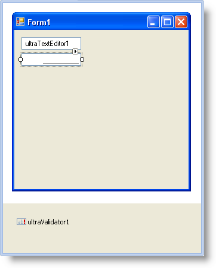

////

|metadata|
{
    "name": "winvalidator-handling-a-validation-error",
    "controlName": ["WinValidator"],
    "tags": [],
    "guid": "{0A4C7FD2-67E8-40F1-9CAB-F906277FF692}",  
    "buildFlags": [],
    "createdOn": "0001-01-01T00:00:00Z"
}
|metadata|
////

= Handling a Validation Error

== Before You Begin

When validating your controls, you're bound to get a few validation errors along the way; otherwise, there'd be no need to validate! You can leave handling these validation errors to WinValidator™ and its default settings, or you can handle the errors yourself in WinValidator's  pick:[win-forms="link:{ApiPlatform}win.misc{ApiVersion}~infragistics.win.misc.ultravalidator~validationerror_ev.html[ValidationError]"]  event.

A few important arguments that the ValidationError event exposes are:

*  pick:[win-forms="link:{ApiPlatform}win.misc{ApiVersion}~infragistics.win.misc.validationerroreventargs~control.html[Control]"]  – A reference to the validated control
*  pick:[win-forms="link:{ApiPlatform}win.misc{ApiVersion}~infragistics.win.misc.validationerroreventargs~editor.html[Editor]"]  – A reference to the validated embeddable editor
*  pick:[win-forms="link:{ApiPlatform}win.misc{ApiVersion}~infragistics.win.misc.validationerroreventargs~notificationsettings.html[NotificationSettings]"]  – An object that defines how you notify your end user of failed validations
*  pick:[win-forms="link:{ApiPlatform}win.misc{ApiVersion}~infragistics.win.misc.validationerroreventargs~validation.html[Validation]"]  – A collection of all validations, including failed ones

Each of these arguments is extremely useful in singling out individual controls that were validated, along with their associated validation results. You can even notify your end user in different ways for different controls. For example, you can notify your end users based on the control's name to individualize the notification based on each control, or you can notify your end user based on the condition a control is being validated by.

== What You Will Accomplish

You will create a new Windows Forms project and validate a WinTextEditor™ control a WinNumericEditor™ control. You will then learn how to notify your end user of failed validations through the ValidationError event for each validated control.

== Follow these Steps

[start=1]
. *Set up your form with the necessary controls* .

.. Create a new Windows Forms project.
.. Double-click UltraTextEditor in the Microsoft® Visual Studio® toolbox. A WinTextEditor control appears on your form.
.. Double-click UltraNumericEditor in the toolbox. A WinNumericEditor control appears on your form.
.. Double-click UltraValidator in the toolbox. A WinValidator component appears in the component tray.
.. Arrange WinTextEditor and WinNumericEditor so your form looks similar to the screen shot below.

[start=2]
. *Create an operator condition to validate WinTextEditor* .

A likely scenario that you will need to validate is a password entry box. Therefore, you'll need to be certain that certain criteria are met, for instance, that the password contains only letters and numbers and is a certain length. In order to validate the password, you'll need to create an operator condition that fails validation when your end user's password does not match the given regular expression.

Create a method that returns a  pick:[win-forms="link:{ApiPlatform}win.misc{ApiVersion}~infragistics.win.misc.validationsettings.html[ValidationSettings]"]  object. In this method, you'll get the ValidationSettings object for whichever control you pass in (in this case, the text box). Once you have a reference to the control's ValidationSettings object, you can create a condition to validate the text box. Later on in this topic, you'll call this method when setting the text box's ValidationSettings object.

*In Visual Basic:*

----
Private Function CreateOperatorCondition(theControl As Control) _
  As ValidationSettings
    Dim thePasswordSettings As ValidationSettings = _
      Me.ultraValidator1.GetValidationSettings(theControl)
    thePasswordSettings.Condition = _
      New OperatorCondition(ConditionOperator.Match, _
      "^[a-z,A-Z,1-9]{8,20}$")
   thePasswordSettings.DataType = GetType(String)
   Return thePasswordSettings
End Function 'CreateOperatorCondition
----

*In C#:*

----
private ValidationSettings CreateOperatorCondition(Control theControl)
{
	ValidationSettings thePasswordSettings =
		this.ultraValidator1.GetValidationSettings(theControl);
	thePasswordSettings.Condition =
		new OperatorCondition(ConditionOperator.Match, "^[a-z,A-Z,1-9]{8,20}$");
	thePasswordSettings.DataType = typeof(string);
	return thePasswordSettings;
}
----

[start=3]
. *Create a range condition to validate WinNumericEditor* .

Another likely scenario that you might encounter is ensuring that a certain number is within a given range. Several controls, such as WinNumericEditor, have built-in properties supplying you with a minimum and maximum number. However, you may not always have this convenience. Therefore, you can use a range condition to test if a certain number (or any object, for that matter) is within a specified range. An example of this type of range would be in a photo-editing application when you need to choose RGB values. RGB values are only valid from 0 to 255, so you can create a range condition that fails validation when your end user enters a value outside that range.

Create another method that returns a ValidationSettings object. In this method, you'll get the ValidationSettings object for whichever control you pass in (in this case, WinNumericEditor). Once you have a reference to the control's ValidationSettings object, you can create a condition to validate WinNumericEditor. Later in this topic, you'll call this method when setting WinNumericEditor's ValidationSettings object.

*In Visual Basic:*

----
Private Function CreateRangeCondition(theControl As Control) _
  As ValidationSettings
    Dim theRGBSettings As ValidationSettings = _
      Me.ultraValidator1.GetValidationSettings(theControl)
    theRGBSettings.Condition = _
      New RangeCondition(0, 255, GetType(Integer))
   Return theRGBSettings
End Function 'CreateRangeCondition
----

*In C#:*

----
private ValidationSettings CreateRangeCondition(Control theControl)
{
	ValidationSettings theRGBSettings =
		this.ultraValidator1.GetValidationSettings(theControl);
	theRGBSettings.Condition =
		new RangeCondition(0, 255, typeof(int));
	return theRGBSettings;
}
----

[start=4]
. *Handle the specific validation errors for WinTextEditor and WinNumericEditor* .

WinValidator exposes a ValidationError event which gives you access to every failed validation. In this event, you can use a SWITCH (SELECT in Visual Basic) statement or IF/ELSE statement to single out different controls and customize their error messages. In the ValidationError event, you'll use a SWITCH statement to apply different logic based on each control's name. In each case, you'll modify the  pick:[win-forms="link:{ApiPlatform}win.misc{ApiVersion}~infragistics.win.misc.notificationsettings.html[NotificationSettings]"]  object to notify your end users in different ways.

In the Form's designer, select the ultraValidator1 component. In the properties window, click the lightning bolt to display the available WinValidator events. Double-click the ValidationError event, Visual Studio creates the ValidationError event handler and you are now in code view. Add the following code to the ValidationError event handler.

*In Visual Basic:*

----
Select Case e.Control.Name
   Case "UltraTextEditor1"
      e.NotificationSettings.Action = _
         NotificationAction.Image
      e.NotificationSettings.Text = _
         "Password must by 8-20 characters long"
   Case "UltraNumericEditor1"
      Dim theRangeCondition As RangeCondition = _
         e.Validation.Errors(0).ValidationSettings.Condition
      e.NotificationSettings.Action = NotificationAction.MessageBox
      Dim theString As New System.Text.StringBuilder([String].Empty)
      theString.Append("The value ")
      theString.Append(e.Validation.Errors(0).Value)
      theString.Append(" is invalid. Please select a value between ")
      theString.Append(theRangeCondition.MinimumValue)
      theString.Append(" and ")
      theString.Append(theRangeCondition.MaximumValue)
      e.NotificationSettings.Text = theString.ToString()
End Select
----

*In C#:*

----
switch (e.Control.Name)
{
	case "ultraTextEditor1":
		e.NotificationSettings.Action =
			NotificationAction.Image;
		e.NotificationSettings.Text = 
			"Password must by 8-20 characters long";
		break;
	case "ultraNumericEditor1":
		RangeCondition theRangeCondition =
			e.Validation.Errors[0].ValidationSettings.Condition as
			RangeCondition;
		e.NotificationSettings.Action =
			NotificationAction.MessageBox;
		StringBuilder theString = new StringBuilder(String.Empty);
		theString.Append("The value ");
		theString.Append(e.Validation.Errors[0].Value);
		theString.Append(" is invalid. Please select a value between ");
		theString.Append(theRangeCondition.MinimumValue);
		theString.Append(" and ");
		theString.Append(theRangeCondition.MaximumValue);
		e.NotificationSettings.Text = theString.ToString();
		break;
}
----

[start=5]
. *Set WinTextEditor and WinNumericEditor's ValidationSettings by calling the previously defined methods* .

WinValidator lets you set a control's ValidationSettings object through either the  pick:[win-forms="link:{ApiPlatform}win.misc{ApiVersion}~infragistics.win.misc.ultravalidator~setvalidationsettings.html[SetValidationSettings]"]  or  pick:[win-forms="link:{ApiPlatform}win.misc{ApiVersion}~infragistics.win.misc.ultravalidator~getvalidationsettings.html[GetValidationSettings]"]  methods. Calling SetValidationSettings allows you to pass in a control and ValidationSettings object to quickly set the given control's ValidationSettings object. Calling the GetValidationSettings method will create a new ValidationSettings object, sets the given control's ValidationSettings property to that object, and returns that ValidationSettings object so you can modify it.

In your Form's Load event, add the following code to set both the WinTextEditor's and WinNumericEditor's ValidationSettings property. Remember that the methods you defined earlier return a ValidationSettings object; therefore, you can pass that method in as the second parameter of the SetValidationSettings method.

*In Visual Basic:*

----
Me.UltraValidator1.SetValidationSettings( _
	Me.UltraTextEditor1, _
	Me.CreateOperatorCondition(Me.UltraTextEditor1))
Me.UltraValidator1.SetValidationSettings( _
	Me.UltraNumericEditor1, _
	Me.CreateRangeCondition(Me.UltraNumericEditor1))
----

*In C#:*

----
this.ultraValidator1.SetValidationSettings(
	this.ultraTextEditor1,
	this.CreateOperatorCondition(this.ultraTextEditor1));
this.ultraValidator1.SetValidationSettings(
	this.ultraNumericEditor1,
	this.CreateRangeCondition(this.ultraNumericEditor1));
----

[start=6]
. *Run the application*