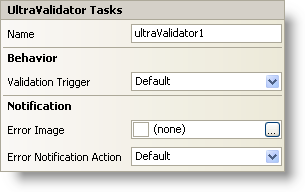

////

|metadata|
{
    "name": "winvalidator-smart-tag",
    "controlName": ["WinValidator"],
    "tags": [],
    "guid": "{94432E10-F125-4C2D-A172-3756920EEDB0}",  
    "buildFlags": [],
    "createdOn": "0001-01-01T00:00:00Z"
}
|metadata|
////

= WinValidator Smart Tag

In Visual Studio 2005 (.NET Framework 2.0), each Infragistics Windows Forms control/component is equipped with a Smart Tag. By simply selecting the control/component, a Smart Tag anchor appears. When you click this anchor, a pop-up panel appears, providing you with quick and easy access to the most common properties and settings of the control/component.

The WinValidator™ Smart Tag contains the name of the control, as well as the following sections:

* Behavior -- Provides easy access to properties that govern how the control behaves on the form.
* Notification -- Provides access to properties that help notify the end user of failed validations.

See below for a description of the item (e.g., field, drop-down list, checkbox) in each section, as well as the item's corresponding property in the properties grid.

[options="header", cols="a,a,a"]
|====
|Behavior|Description|Corresponding Property

|Validation Trigger
|Determines through which event on the extended control that WinValidator will validate.
| link:infragistics4.win.misc.v{ProductVersion}~infragistics.win.misc.ultravalidator~validationtrigger.html[ValidationTrigger]

|====

[options="header", cols="a,a,a"]
|====
|Notification|Description|Corresponding Property

|Error Image
|The image that displays when the control being validated fails validation.
| link:infragistics4.win.misc.v{ProductVersion}~infragistics.win.misc.notificationsettings~image.html[Image]

|Error Notification Action
|This property determines how the end user is notified when a control fails validation.
| link:infragistics4.win.misc.v{ProductVersion}~infragistics.win.misc.notificationsettings~action.html[Action]

|====