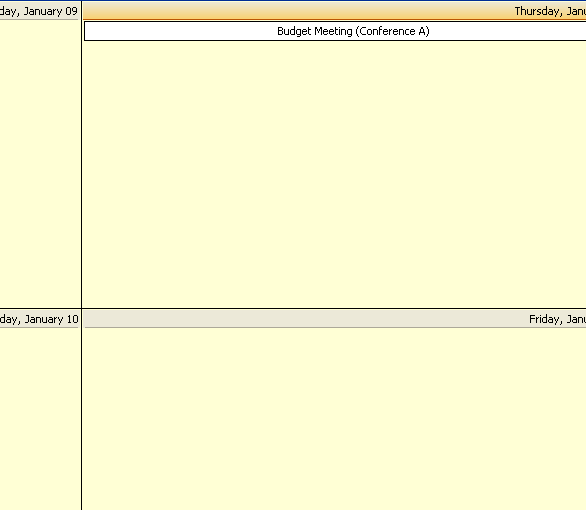

////

|metadata|
{
    "name": "winweekview-about-winweekview",
    "controlName": ["WinWeekView"],
    "tags": [],
    "guid": "{034278AF-99FE-461D-90DB-440308987551}",  
    "buildFlags": [],
    "createdOn": "0001-01-01T00:00:00Z"
}
|metadata|
////

= About WinWeekView

The WinWeekView™ is a Windows Forms control that displays data over a one-week span. The following is a list of some of the functionalities available in WinWeekView:

* Viewing -- Allows the viewing of appointments, notes, owners, and other items over a one-week span.
* Adding/Updating/Removing -- Allows you to add, update, and remove appointments, notes, owners, and other items using the WinCalendarInfo component.
* Appearance Support -- Full appearance support including alpha-blending, gradients, and images. Some appearances can be set at the control level, the others are set using the WinCalendarLook component.
* Built-in Theming -- Supports Standard, Office 2003, Visual Studio 2005 and Office 2007 themes via the WinCalendarLook component.

