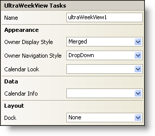

////

|metadata|
{
    "name": "winweekview-smart-tag",
    "controlName": ["WinWeekView"],
    "tags": ["Design Environment"],
    "guid": "{AC37C3D4-7B88-4DC1-BD6F-7433E0CC16EF}",  
    "buildFlags": [],
    "createdOn": "0001-01-01T00:00:00Z"
}
|metadata|
////

= WinWeekView Smart Tag

In Visual Studio 2005 (.NET Framework 2.0), each Infragistics Windows Forms control/component is equipped with a Smart Tag. By simply selecting the control/component, a Smart Tag anchor appears. When you click this anchor, a pop-up panel appears, providing you with quick and easy access to the most common properties and settings of the control/component.

The WinWeekView™ Smart Tag contains the name of the control, as well as the following sections:

* Appearance -- Provides common tasks involving the appearance, look, and feel of the control.
* Data -- Refers to any underlying data the control is using such as data sources and data members.
* Layout -- Offers properties that will determine where and how the control is placed on the form.

See below for a description of the item (e.g., field, drop-down list, checkbox) in each section, as well as the item's corresponding property in the properties grid.

[options="header", cols="a,a,a"]
|====
|Appearance|Description|Corresponding Property

|Owner Display Style
|Select Merged to show all owners together or Separate to show them separated.
| pick:[win-forms="link:infragistics4.win.ultrawinschedule.v{ProductVersion}~infragistics.win.ultrawinschedule.ultramonthviewsinglebase~ownerdisplaystyle.html[OwnerDisplayStyle]"] 

|Owner Navigation Style
|This setting will allow the user to cycle through different owners with a drop down, scroll bar, both a drop down and scroll bar, scroll buttons, or no navigation at all.
| pick:[win-forms="link:infragistics4.win.ultrawinschedule.v{ProductVersion}~infragistics.win.ultrawinschedule.ultramonthviewsinglebase~ownernavigationstyle.html[OwnerNavigationStyle]"] 

|Calendar Look
|Upon clicking the drop-down, all available WinCalendarLook controls on the form will be displayed.
| pick:[win-forms="link:infragistics4.win.ultrawinschedule.v{ProductVersion}~infragistics.win.ultrawinschedule.ultraschedulecontrolbase~calendarlook.html[CalendarLook]"] 

|====

[options="header", cols="a,a,a"]
|====
|Data|Description|Corresponding Property

|Calendar Info
|Upon clicking the drop-down, all available WinCalendarInfo controls on the form will be displayed.
| pick:[win-forms="link:infragistics4.win.ultrawinschedule.v{ProductVersion}~infragistics.win.ultrawinschedule.ultraschedulecontrolbase~calendarinfo.html[CalendarInfo]"] 

|====

[options="header", cols="a,a,a"]
|====
|Layout|Description|Corresponding Property

|Dock
|Choose to dock the WinWeekView top, right, bottom, left, fill, and none.
|Dock

|====