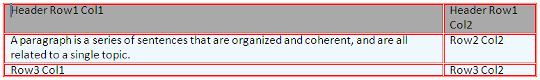
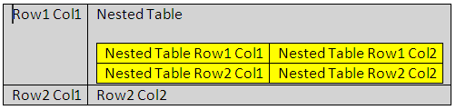

////

|metadata|
{
    "name": "word-add-table-to-word-document",
    "controlName": ["Infragistics Word Library"],
    "tags": ["Exporting","Getting Started","How Do I"],
    "guid": "f8bfd701-eb0a-4d93-89fc-71d74695143c",  
    "buildFlags": [],
    "createdOn": "2011-03-18T14:27:32.391061Z"
}
|metadata|
////

= Adding Table to Word Document

This document demonstrates with examples how to add to a Word document a table with a heading row and a nested table.

The topic is organized as follows:

* <<Intro,Introduction>>
* <<Req,Requirements>>
* <<FormatTable,Formatting Tables - Overview>>
* <<Ex,Examples>>

** <<ExTableWithHeader,Example: Creating a Table With a Header Row>>

*** <<PrevTableWithHeader,Preview>>
*** <<CodeTableWithHeader,Code Sample>>

** <<ExNestedTable,Example: Creating a Nested Table>>

*** <<PrevNestedTable,Preview>>
*** <<CodeNestedTable,Code Sample>>

* <<relatedTopics,Related Topics>>

[[Intro]]
== Introduction

Infragistics Word library enables you to insert tables in your Word document. A table will help you align columns and rows of text with ease.

[[Req]]
== Requirements

A reference to the Infragsitics3.Documents.IO assembly is required.

[[FormatTable]]
== Formatting Tables - Overview

Formatting table, table rows, and table cells is handled by various classes, such as:

* link:{ApiPlatform}documents.io{ApiVersion}~infragistics.documents.word.tableproperties.html[TableProperties]
* link:{ApiPlatform}documents.io{ApiVersion}~infragistics.documents.word.tablerowproperties.html[TableRowProperties]
* link:{ApiPlatform}documents.io{ApiVersion}~infragistics.documents.word.tablecellproperties.html[TableCellProperties]
* link:{ApiPlatform}documents.io{ApiVersion}~infragistics.documents.word.tableborderproperties.html[TableBorderProperties]

[[Ex]]
== Examples

[[ExTableWithHeader]]
== Example: Creating a Table With a Header Row

The code below creates a table with two columns and three rows using the link:{ApiPlatform}documents.io{ApiVersion}~infragistics.documents.word.worddocumentwriter.html[WordDocumentWriter] streamer object. The first row is set as a header row using the link:{ApiPlatform}documents.io{ApiVersion}~infragistics.documents.word.tablerowproperties~isheaderrow.html[IsHeaderRow] property of the TableRowProperties object.

[[PrevTableWithHeader]]
== Preview

Following is a preview of the final result:

====== Figure 1: A table with headers in Word document as created by the example code

[[CodeTableWithHeader]]
== Code Sample

*In C#:*

----
using Infragistics.Documents.Word;
// Create a new instance of the WordDocumentWriter class using the
// static 'Create' method.
// This instance must be closed once content is written into Word.
WordDocumentWriter docWriter = WordDocumentWriter.Create(@"C:\TestWordDoc.docx");
docWriter.StartDocument();
// Create border properties for Table
TableBorderProperties borderProps = docWriter.CreateTableBorderProperties();
borderProps.Color = Color.Red;
borderProps.Style = TableBorderStyle.Double;
// Create table properties
TableProperties tableProps = docWriter.CreateTableProperties();
tableProps.Alignment = ParagraphAlignment.Center;
tableProps.BorderProperties.Color = borderProps.Color;
tableProps.BorderProperties.Style = borderProps.Style;
// Create table row properties
TableRowProperties rowProps = docWriter.CreateTableRowProperties();
//Make the row a Header
rowProps.IsHeaderRow = true;
// Create table cell properties
TableCellProperties cellProps = docWriter.CreateTableCellProperties();
cellProps.BackColor = Color.DarkGray;
cellProps.TextDirection = TableCellTextDirection.LeftToRightTopToBottom;
// Begin a table with 2 columns, and apply the table properties
docWriter.StartTable(2, tableProps);
// Begin a Row and apply table row properties
// This row will be set as the Header row by the row properties
// HEADER ROW
docWriter.StartTableRow(rowProps);
// Cell Value for 1st row 1st column
// Start a Paragraph and add a text run to the cell
docWriter.StartTableCell(cellProps);
docWriter.StartParagraph();
docWriter.AddTextRun("Header Row1 Col1");
docWriter.EndParagraph();
docWriter.EndTableCell();
// Cell value for 1st row 2nd column
docWriter.StartTableCell(cellProps);
docWriter.StartParagraph();
docWriter.AddTextRun("Header Row1 Col2");
docWriter.EndParagraph();
docWriter.EndTableCell();
// End the Table Row
docWriter.EndTableRow();
// Reset the cell properties, so that the
// cell properties are different from the header cells.
cellProps.Reset();
cellProps.BackColor = Color.AliceBlue;
// DATA ROW
docWriter.StartTableRow();
// Cell Value for 2nd row 1st column
docWriter.StartTableCell(cellProps);
docWriter.StartParagraph();
docWriter.AddTextRun("A paragraph is a series of sentences that are organized and coherent, and are all related to a single topic. ");
docWriter.EndParagraph();
docWriter.EndTableCell();
// Cell Value for 2nd row 2nd column
docWriter.StartTableCell(cellProps);
docWriter.StartParagraph();
docWriter.AddTextRun("Row2 Col2");
docWriter.EndParagraph();
docWriter.EndTableCell();
docWriter.EndTableRow();
// DATA ROW
docWriter.StartTableRow();
// Cell Value for 3rd row 1st column
docWriter.StartTableCell(cellProps);
docWriter.StartParagraph();
docWriter.AddTextRun("Row3 Col1");
docWriter.EndParagraph();
docWriter.EndTableCell();
// Cell Value for 3rd row 2nd column
docWriter.StartTableCell(cellProps);
docWriter.StartParagraph();
docWriter.AddTextRun("Row3 Col2");
docWriter.EndParagraph();
docWriter.EndTableCell();
docWriter.EndTableRow();
docWriter.EndTable();
docWriter.EndDocument();
// Close the WordDocumentWriter instance.
docWriter.Close();
----

*In Visual Basic:*

----
'  Create a new instance of the WordDocumentWriter class using the
'  static 'Create' method.
Dim docWriter As WordDocumentWriter = WordDocumentWriter.Create("C:\TestWordDoc.docx")
docWriter.StartDocument()
' Create border properties for Table
Dim borderProps As TableBorderProperties = docWriter.CreateTableBorderProperties()
borderProps.Color = Color.Red
borderProps.Style = TableBorderStyle.[Double]
' Create table properties
Dim tableProps As TableProperties = docWriter.CreateTableProperties()
tableProps.Alignment = ParagraphAlignment.Center
tableProps.BorderProperties.Color = borderProps.Color
tableProps.BorderProperties.Style = borderProps.Style
' Create table row properties
Dim rowProps As TableRowProperties = docWriter.CreateTableRowProperties()
'Make the row a Header
rowProps.IsHeaderRow = True
' Create table cell properties
Dim cellProps As TableCellProperties = docWriter.CreateTableCellProperties()
cellProps.BackColor = Color.DarkGray
cellProps.TextDirection = TableCellTextDirection.LeftToRightTopToBottom
' Begin a table with 2 columns, and apply the table properties
docWriter.StartTable(2, tableProps)
' Begin a Row and apply table row properties
' This row will be set as the Header row by the row properties
' HEADER ROW
docWriter.StartTableRow(rowProps)
' Cell Value for 1st row 1st column
' Start a Paragraph and add a text run to the cell
docWriter.StartTableCell(cellProps)
docWriter.StartParagraph()
docWriter.AddTextRun("Header Row1 Col1")
docWriter.EndParagraph()
docWriter.EndTableCell()
' Cell value for 1st row 2nd column
docWriter.StartTableCell(cellProps)
docWriter.StartParagraph()
docWriter.AddTextRun("Header Row1 Col2")
docWriter.EndParagraph()
docWriter.EndTableCell()
' End the Table Row
docWriter.EndTableRow()
' Reset the cell properties, so that the
' cell properties are different from the header cells.
cellProps.Reset()
cellProps.BackColor = Color.AliceBlue
' DATA ROW
docWriter.StartTableRow()
' Cell Value for 2nd row 1st column
docWriter.StartTableCell(cellProps)
docWriter.StartParagraph()
docWriter.AddTextRun("A paragraph is a series of sentences that are organized and coherent, and are all related to a single topic. ")
docWriter.EndParagraph()
docWriter.EndTableCell()
' Cell Value for 2nd row 2nd column
docWriter.StartTableCell(cellProps)
docWriter.StartParagraph()
docWriter.AddTextRun("Row2 Col2")
docWriter.EndParagraph()
docWriter.EndTableCell()
docWriter.EndTableRow()
' DATA ROW
docWriter.StartTableRow()
' Cell Value for 3rd row 1st column
docWriter.StartTableCell(cellProps)
docWriter.StartParagraph()
docWriter.AddTextRun("Row3 Col1")
docWriter.EndParagraph()
docWriter.EndTableCell()
' Cell Value for 3rd row 2nd column
docWriter.StartTableCell(cellProps)
docWriter.StartParagraph()
docWriter.AddTextRun("Row3 Col2")
docWriter.EndParagraph()
docWriter.EndTableCell()
docWriter.EndTableRow()
docWriter.EndTable()
docWriter.EndDocument()
docWriter.Close()
----

[[ExNestedTable]]
== Example: Creating a Nested Table

Nested Table is a table appearing inside another table. The following code creates a primary table with two columns, two rows and a nested table with two columns, two rows. The first row second column of the primary table holds the nested table.

[[PrevNestedTable]]
== Preview

Following is a preview of the final result:

====== Figure 2: A nested table in Word document as created by the example code

[[CodeNestedTable]]
== Code Sample

*In C#:*

----
// Create a new instance of the WordDocumentWriter
// class using the static 'Create' method.
// This instance must be closed once content is written into Word.
WordDocumentWriter docWriter = WordDocumentWriter.Create(@"C:\TestWordDoc.docx");
TableCellProperties cellProps = docWriter.CreateTableCellProperties();
cellProps.BackColor = Color.LightGray;
docWriter.StartDocument();
// Begin a Table with 2 columns
docWriter.StartTable(2);
// Begin a table row
docWriter.StartTableRow();
// Begin Table cell for first row first column
docWriter.StartTableCell(cellProps);
docWriter.StartParagraph();
docWriter.AddTextRun("Row1 Col1");
docWriter.EndParagraph();
docWriter.EndTableCell();
// Begin Table cell for first row second column
docWriter.StartTableCell(cellProps);
#region // Nested Table
docWriter.StartParagraph();
docWriter.AddTextRun("Nested Table");
docWriter.AddNewLine();
docWriter.EndParagraph();
docWriter.StartTable(2);
docWriter.StartTableRow();
cellProps.Reset();
cellProps.BackColor = Color.Yellow;
docWriter.StartTableCell(cellProps);
docWriter.StartParagraph();
docWriter.AddTextRun("Nested Table Row1 Col1");
docWriter.EndParagraph();
docWriter.EndTableCell();
docWriter.StartTableCell(cellProps);
docWriter.StartParagraph();
docWriter.AddTextRun("Nested Table Row1 Col2");
docWriter.EndParagraph();
docWriter.EndTableCell();
docWriter.EndTableRow();
docWriter.StartTableRow();
docWriter.StartTableCell(cellProps);
docWriter.StartParagraph();
docWriter.AddTextRun("Nested Table Row2 Col1");
docWriter.EndParagraph();
docWriter.EndTableCell();
docWriter.StartTableCell(cellProps);
docWriter.StartParagraph();
docWriter.AddTextRun("Nested Table Row2 Col2");
docWriter.EndParagraph();
docWriter.EndTableCell();
docWriter.EndTableRow();
// For nested tables at least one paragraph must be added after adding the table within the cell.
// The EndTable method exposes an overload that adds an empty paragraph. 
docWriter.EndTable(true);
#endregion // Nested Table
docWriter.EndTableCell();
docWriter.EndTableRow();
docWriter.StartTableRow();
cellProps.Reset();
cellProps.BackColor = Color.LightGray;
docWriter.StartTableCell(cellProps);
docWriter.StartParagraph();
docWriter.AddTextRun("Row2 Col1");
docWriter.EndParagraph();
docWriter.EndTableCell();
docWriter.StartTableCell(cellProps);
docWriter.StartParagraph();
docWriter.AddTextRun("Row2 Col2");
docWriter.EndParagraph();
docWriter.EndTableCell();
docWriter.EndTableRow();
docWriter.EndTable();
docWriter.EndDocument();
// Close the WordDocumentWriter instance.
docWriter.Close();
----

*In Visual Basic:*

----
'  Create a new instance of the WordDocumentWriter
'  class using the static 'Create' method.
'  This instance must be closed once content is written into Word.
Dim docWriter As WordDocumentWriter = WordDocumentWriter.Create("C:\TestWordDoc.docx")
'string WordDocname = Application.StartupPath + "\\TestWordDoc.docx";
'WordDocumentWriter docWriter = WordDocumentWriter.Create(WordDocname);
Dim cellProps As TableCellProperties = docWriter.CreateTableCellProperties()
cellProps.BackColor = Color.LightGray
docWriter.StartDocument()
' Begin a Table with 2 columns
docWriter.StartTable(2)
' Begin a table row
docWriter.StartTableRow()
' Begin Table cell for first row first column
docWriter.StartTableCell(cellProps)
docWriter.StartParagraph()
docWriter.AddTextRun("Row1 Col1")
docWriter.EndParagraph()
docWriter.EndTableCell()
' Begin Table cell for first row second column
docWriter.StartTableCell(cellProps)
'#Region ""
docWriter.StartParagraph()
docWriter.AddTextRun("Nested Table")
docWriter.AddNewLine()
docWriter.EndParagraph()
docWriter.StartTable(2)
docWriter.StartTableRow()
cellProps.Reset()
cellProps.BackColor = Color.Yellow
docWriter.StartTableCell(cellProps)
docWriter.StartParagraph()
docWriter.AddTextRun("Nested Table Row1 Col1")
docWriter.EndParagraph()
docWriter.EndTableCell()
docWriter.StartTableCell(cellProps)
docWriter.StartParagraph()
docWriter.AddTextRun("Nested Table Row1 Col2")
docWriter.EndParagraph()
docWriter.EndTableCell()
docWriter.EndTableRow()
docWriter.StartTableRow()
docWriter.StartTableCell(cellProps)
docWriter.StartParagraph()
docWriter.AddTextRun("Nested Table Row2 Col1")
docWriter.EndParagraph()
docWriter.EndTableCell()
docWriter.StartTableCell(cellProps)
docWriter.StartParagraph()
docWriter.AddTextRun("Nested Table Row2 Col2")
docWriter.EndParagraph()
docWriter.EndTableCell()
docWriter.EndTableRow()
' For nested tables atleast one paragraph must be added
' after adding the table within the cell.
' The EndTable method exposes an overload that adds an empty paragraph.
docWriter.EndTable(True)
'#End Region
docWriter.EndTableCell()
docWriter.EndTableRow()
docWriter.StartTableRow()
cellProps.Reset()
cellProps.BackColor = Color.LightGray
docWriter.StartTableCell(cellProps)
docWriter.StartParagraph()
docWriter.AddTextRun("Row2 Col1")
docWriter.EndParagraph()
docWriter.EndTableCell()
docWriter.StartTableCell(cellProps)
docWriter.StartParagraph()
docWriter.AddTextRun("Row2 Col2")
docWriter.EndParagraph()
docWriter.EndTableCell()
docWriter.EndTableRow()
docWriter.EndTable()
docWriter.EndDocument()
' Close the WordDocumentWriter instance.
docWriter.Close()
----

[[relatedTopics]]
== Related Topics

* link:word-create-a-word-document.html[Creating a Word Document]
* link:word-apply-formatting-to-word-document.html[Applying Formatting to Word Document]
* link:word-add-images-to-word-document.html[Adding Images to Word Document]
* link:word-headers-footers-and-page-numbers.html[Headers Footers and Page Numbers]
* link:word-understanding-infragistics-word-library.html[Understanding Infragistics Word Library]