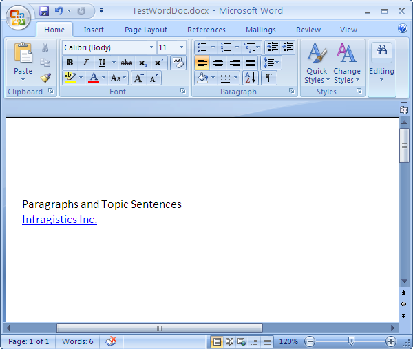

////

|metadata|
{
    "name": "word-create-a-word-document",
    "controlName": ["Infragistics Word Library"],
    "tags": ["Exporting","Getting Started","How Do I"],
    "guid": "9d31e13c-baee-4688-924f-5fa1f2aa2b0f",  
    "buildFlags": [],
    "createdOn": "2011-03-18T14:01:13.481061Z"
}
|metadata|
////

= Creating a Word Document

This topic illustrates how to create a Word document using the forward-only link:{ApiPlatform}documents.io{ApiVersion}~infragistics.documents.word.worddocumentwriter.html[WordDocumentWriter] streamer object. The static Create method of the WordDocumentWriter object creates a new Word document.

The following screenshot shows a Word document created with text and hyper link:

The various properties of the document such as Author, Title, Subject etc., can be set using the link:{ApiPlatform}documents.io{ApiVersion}~infragistics.documents.word.worddocumentwriter~documentproperties.html[DocumentProperties] property of the WordDocumentWriter object. These information can be accessed in Word 2007 by clicking the Office Button and navigating to Prepare > Properties section. Similarly in Word 2010 by clicking the File tab the document properties can be accessed from the right side of the backstage view.

In order to start writing into the Word document use the link:{ApiPlatform}documents.io{ApiVersion}~infragistics.documents.word.worddocumentwriter~startdocument.html[StartDocument] method that must be balanced with a corresponding call to the link:{ApiPlatform}documents.io{ApiVersion}~infragistics.documents.word.worddocumentwriter~enddocument.html[EndDocument] method.

A Paragraph provides the ability to display a block of text which can be aligned or indented. Use the link:{ApiPlatform}documents.io{ApiVersion}~infragistics.documents.word.worddocumentwriter~startparagraph.html[StartParagraph] method to begin a paragraph. The link:{ApiPlatform}documents.io{ApiVersion}~infragistics.documents.word.worddocumentwriter~addtextrun.html[AddTextRun] method provides a way to add content to the paragraph. Once content is added the paragraph must be closed using the link:{ApiPlatform}documents.io{ApiVersion}~infragistics.documents.word.worddocumentwriter~endparagraph.html[EndParagraph] method.

.Note
[NOTE]
====
A reference to the Infragistics3.Documents.IO assembly is required for the following code.
====

.Note
[NOTE]
====
When using the WordDocumentWriter object for creating Word documents the streamer object must be disposed or closed using either the Dispose or Close method.
====

*In C#:*

----
using Infragistics.Documents.Word;
// Create a new instance of the WordDocumentWriter class
// using the static 'Create' method.
WordDocumentWriter docWriter = WordDocumentWriter.Create(@"C:\TestWordDoc.docx");
// Use inches as the unit of measure
docWriter.Unit = UnitOfMeasurement.Inch;
// Set the document properties, such as title, author, etc.
docWriter.DocumentProperties.Title = "Sample Document";
docWriter.DocumentProperties.Author = string.Format("Infragistics.{0}", SystemInformation.UserName);
// Start the document...note that each call to
// StartDocument must be balanced with a corresponding call to EndDocument.
docWriter.StartDocument();
//  Start a paragraph
docWriter.StartParagraph();
//  Add a text run for the title
docWriter.AddTextRun("Paragraphs and Topic Sentences");
// Add a new line
docWriter.AddNewLine();
//  Add a Hyperlink
docWriter.AddHyperlink("http://www.infragistics.com", "Infragistics Inc.");
//  End the paragraph
docWriter.EndParagraph();
//  End Document
docWriter.EndDocument();
// Close the writer
docWriter.Close();
----

*In Visual Basic:*

----
Imports Infragistics.Documents.Word
'  Create a new instance of the WordDocumentWriter class using the
'  static 'Create' method.
Dim docWriter As WordDocumentWriter = WordDocumentWriter.Create("C:\TestWordDoc.docx")
'  Use inches as the unit of measure
docWriter.Unit = UnitOfMeasurement.Inch
'  Set the document properties, such as title, author, etc.
docWriter.DocumentProperties.Title = "Sample Document"
docWriter.DocumentProperties.Author = String.Format("Infragistics.{0}", SystemInformation.UserName)
'  Start the document...note that each call to StartDocument must
'  be balanced with a corresponding call to EndDocument.
docWriter.StartDocument()
'  Start a paragraph
docWriter.StartParagraph()
'  Add a text run for the title
docWriter.AddTextRun("Paragraphs and Topic Sentences")
' Add a new line
docWriter.AddNewLine()
' Add a Hyperlink
docWriter.AddHyperlink("http://www.infragistics.com", "Infragistics Inc.")
'End the paragraph
docWriter.EndParagraph()
docWriter.EndDocument()
' Close the writer
docWriter.Close()
----

== Related Topics

* link:word-apply-formatting-to-word-document.html[Apply Formatting to Word Document]
* link:word-add-table-to-word-document.html[Add Table to Word Document]
* link:word-add-images-to-word-document.html[Add Images to Word Document]
* link:word-headers-footers-and-page-numbers.html[Headers Footers and Page Numbers]
* link:word-understanding-infragistics-word-library.html[Understanding Infragistics Word Library]