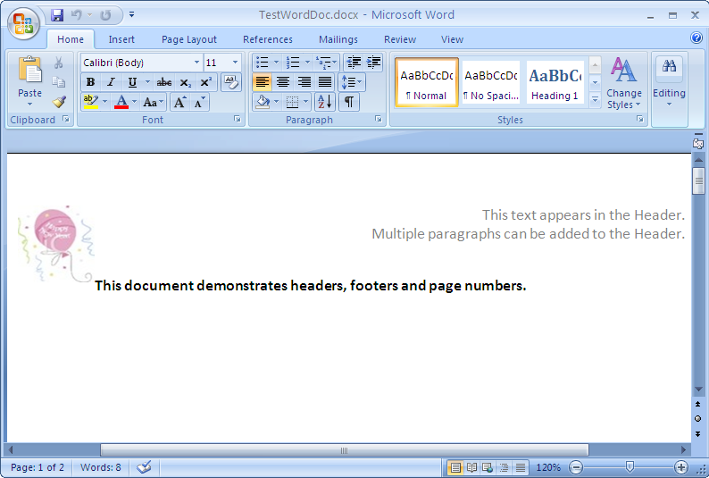
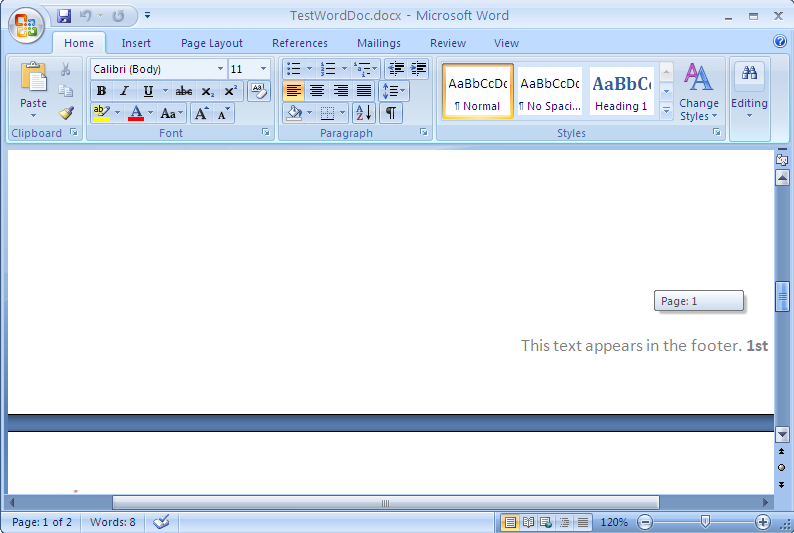

////

|metadata|
{
    "name": "word-headers-footers-and-page-numbers",
    "controlName": ["Infragistics Word Library"],
    "tags": ["Exporting","Getting Started","How Do I"],
    "guid": "4179bd83-1b9f-49c3-aff1-fb0423512fec",  
    "buildFlags": [],
    "createdOn": "2011-03-18T14:35:12.505061Z"
}
|metadata|
////

= Headers Footers and Page Numbers

Using the Infragistics Word library you can create headers and footers that may be as simple as a document title and a page number to images, multiple paragraphs, tables and hyperlinks.

The following screenshots depicts a Word document created with text and image in the Header:

The following screenshots depicts a Word document created with text and page number in the Footer:

.Note
[NOTE]
====
A reference to the Infragistics3.Documents.IO assembly is required for the following code.
====

== Headers and Footers

To write content to the headers and footers in a document section you must use the link:{ApiPlatform}documents.io{ApiVersion}~infragistics.documents.word.sectionheaderfooterwriterset.html[SectionHeaderFooterWriterSet] class that holds one or more link:{ApiPlatform}documents.io{ApiVersion}~infragistics.documents.word.wordheaderfooterwriter.html[WordHeaderFooterWriter] instances. The headers and footers can either be set to all pages or to the first page only. Text, image, multiple paragraphs, hyperlinks can all be added to the header and footer sections.

*In C#:*

----
using Infragistics.Documents.Word;
//  Specify the default parts for header and footer
SectionHeaderFooterParts parts = SectionHeaderFooterParts.HeaderAllPages | SectionHeaderFooterParts.FooterAllPages;
SectionHeaderFooterWriterSet writerSet = docWriter.AddSectionHeaderFooter(parts);
// Set text for Header
writerSet.HeaderWriterAllPages.Open();
writerSet.HeaderWriterAllPages.StartParagraph();
writerSet.HeaderWriterAllPages.AddTextRun("This text appears in the Header.");
writerSet.HeaderWriterAllPages.EndParagraph();
writerSet.HeaderWriterAllPages.Close();
// Set text for Footer
writerSet.FooterWriterAllPages.Open();
writerSet.FooterWriterAllPages.StartParagraph();
writerSet.FooterWriterAllPages.AddTextRun("This text appears in the footer.");
writerSet.FooterWriterAllPages.EndParagraph();
writerSet.FooterWriterAllPages.Close();
----

*In Visual Basic:*

----
Imports Infragistics.Documents.Word
'  Specify the default parts for header and footer
Dim parts As SectionHeaderFooterParts = SectionHeaderFooterParts.HeaderAllPages Or SectionHeaderFooterParts.FooterAllPages
Dim writerSet As SectionHeaderFooterWriterSet = docWriter.AddSectionHeaderFooter(parts)
' Set text for Header
writerSet.HeaderWriterAllPages.Open()
writerSet.HeaderWriterAllPages.StartParagraph()
writerSet.HeaderWriterAllPages.AddTextRun("This text appears in the Header.")
writerSet.HeaderWriterAllPages.EndParagraph()
writerSet.HeaderWriterAllPages.Close()
' Set text for Footer
writerSet.FooterWriterAllPages.Open()
writerSet.FooterWriterAllPages.StartParagraph()
writerSet.FooterWriterAllPages.AddTextRun("This text appears in the footer. ")
writerSet.FooterWriterAllPages.EndParagraph()
writerSet.FooterWriterAllPages.Close()
----

== Page Numbers

Page numbers are possible by adding the right settings to either the header or footer of a Word document using the link:{ApiPlatform}documents.io{ApiVersion}~infragistics.documents.word.wordheaderfooterwriter~addpagenumberfield.html[AddPageNumberField] method. This method accepts the PageNumberFieldType enum value and font object as optional argument. The PageNumberFieldType enum offers several formats such as Decimal, RomanLowercase, TextCardinal, Ordinal etc., for the page numbers.

*In C#:*

----
using Infragistics.Documents.Word;
// Add Page numbers to the Footer
writerSet.FooterWriterAllPages.AddPageNumberField(PageNumberFieldFormat.Ordinal, font);
----

*In Visual Basic:*

----
Imports Infragistics.Documents.Word
' Add Page numbers to the Footer
writerSet.FooterWriterAllPages.AddPageNumberField(PageNumberFieldFormat.Ordinal, font)
----

The following complete code adds header, footer and page numbers to the Word document.

*In C#:*

----
using Infragistics.Documents.Word;
// Create a new instance of the WordDocumentWriter class using the
// static 'Create' method.
//  This instance must be closed once content is written into Word.
WordDocumentWriter docWriter = WordDocumentWriter.Create(@"C:\TestWordDoc.docx");
//  Use inches as the unit of measure
docWriter.Unit = UnitOfMeasurement.Inch;
//  Create a font, which we can use in content creation
Infragistics.Documents.Word.Font font = docWriter.CreateFont();
font.Bold = true;
// Paragraph Properties
ParagraphProperties paraformat = docWriter.CreateParagraphProperties();
//Start the document...note that each call to StartDocument must
//be balanced with a corresponding call to EndDocument.
docWriter.StartDocument();
//Start a paragraph
docWriter.StartParagraph();
docWriter.AddNewLine();
docWriter.AddTextRun("This document demonstrates headers, footers and page numbers.", font);
// End the paragraph
docWriter.EndParagraph();
// Create a page break
paraformat.PageBreakBefore = true;
docWriter.StartParagraph(paraformat);
docWriter.EndParagraph();
// Header and Footer
//  Specify the default parts for header and footer.
SectionHeaderFooterParts parts = SectionHeaderFooterParts.HeaderAllPages | SectionHeaderFooterParts.FooterAllPages;
SectionHeaderFooterWriterSet writerSet = docWriter.AddSectionHeaderFooter(parts);
// Get Image to display in the Header
Image img = Image.FromFile(@"..\..\Ballon_New_Year.jpg");
// Create an Anchored Image
AnchoredPicture anchPic = docWriter.CreateAnchoredPicture(img);
anchPic.Size = new SizeF(0.75f, 0.75f);
// Reset paragraph properties
paraformat.Reset();
paraformat.Alignment = ParagraphAlignment.Right;
// Header
writerSet.HeaderWriterAllPages.Open();
// The header text alignment is set to right
// by passing in the ParagraphProperties instance
writerSet.HeaderWriterAllPages.StartParagraph(paraformat);
// Add Image to the header
writerSet.HeaderWriterAllPages.AddAnchoredPicture(anchPic);
// Add text to the Header
writerSet.HeaderWriterAllPages.AddTextRun("This text appears in the Header.");
writerSet.HeaderWriterAllPages.EndParagraph();
writerSet.HeaderWriterAllPages.StartParagraph(paraformat);
// Add text to the Header
writerSet.HeaderWriterAllPages.AddTextRun("Multiple paragraphs can be added to the Header.");
writerSet.HeaderWriterAllPages.EndParagraph();
writerSet.HeaderWriterAllPages.Close();
//Footer
writerSet.FooterWriterAllPages.Open();
// The footer text alignment is set to right
// by passing in the ParagraphProperties instance
writerSet.FooterWriterAllPages.StartParagraph(paraformat);
writerSet.FooterWriterAllPages.AddTextRun("This text appears in the footer. ");
// Add Page numbers to the Footer
writerSet.FooterWriterAllPages.AddPageNumberField(PageNumberFieldFormat.Ordinal, font);
writerSet.FooterWriterAllPages.EndParagraph();
writerSet.FooterWriterAllPages.Close();
// End the Document
docWriter.EndDocument();
// Close the writer
docWriter.Close();
----

*In Visual Basic:*

----
Imports Infragistics.Documents.Word
' Create a new instance of the WordDocumentWriter class using the
' static 'Create' method.
'  This instance must be closed once content is written into Word.
Dim docWriter As WordDocumentWriter = WordDocumentWriter.Create("C:\TestWordDoc.docx")
'  Use inches as the unit of measure
docWriter.Unit = UnitOfMeasurement.Inch
'  Create a font, which we can use in content creation
Dim font As Infragistics.Documents.Word.Font = docWriter.CreateFont()
font.Bold = True
' Paragraph Properties
Dim paraformat As ParagraphProperties = docWriter.CreateParagraphProperties()
'Start the document...note that each call to StartDocument must
'be balanced with a corresponding call to EndDocument.
docWriter.StartDocument()
'Start a paragraph
docWriter.StartParagraph()
docWriter.AddNewLine()
docWriter.AddTextRun("This document demonstrates headers, footers and page numbers.", font)
' End the paragraph
docWriter.EndParagraph()
' Create a page break
paraformat.PageBreakBefore = True
docWriter.StartParagraph(paraformat)
docWriter.EndParagraph()
' Header and Footer
'  Specify the default parts for header and footer.
Dim parts As SectionHeaderFooterParts = SectionHeaderFooterParts.HeaderAllPages Or SectionHeaderFooterParts.FooterAllPages
Dim writerSet As SectionHeaderFooterWriterSet = docWriter.AddSectionHeaderFooter(parts)
' Get Image to display in the Header
Dim img As Image = Image.FromFile("..\..\Ballon_New_Year.jpg")
' Create an Anchored Image
Dim anchPic As AnchoredPicture = docWriter.CreateAnchoredPicture(img)
anchPic.Size = New SizeF(0.75F, 0.75F)
' Reset paragraph properties
paraformat.Reset()
paraformat.Alignment = ParagraphAlignment.Right
' Header
writerSet.HeaderWriterAllPages.Open()
' The header text alignment is set to right
' by passing in the ParagraphProperties instance
writerSet.HeaderWriterAllPages.StartParagraph(paraformat)
' Add Image to the header
writerSet.HeaderWriterAllPages.AddAnchoredPicture(anchPic)
' Add text to the Header
writerSet.HeaderWriterAllPages.AddTextRun("This text appears in the Header.")
writerSet.HeaderWriterAllPages.EndParagraph()
writerSet.HeaderWriterAllPages.StartParagraph(paraformat)
' Add text to the Header
writerSet.HeaderWriterAllPages.AddTextRun("Multiple paragraphs can be added to the Header.")
writerSet.HeaderWriterAllPages.EndParagraph()
writerSet.HeaderWriterAllPages.Close()
'Footer
writerSet.FooterWriterAllPages.Open()
' The footer text alignment is set to right
' by passing in the ParagraphProperties instance
writerSet.FooterWriterAllPages.StartParagraph(paraformat)
writerSet.FooterWriterAllPages.AddTextRun("This text appears in the footer. ")
writerSet.FooterWriterAllPages.AddPageNumberField(PageNumberFieldFormat.Ordinal, font)
writerSet.FooterWriterAllPages.EndParagraph()
writerSet.FooterWriterAllPages.Close()
' End the Document
docWriter.EndDocument()
' Close the writer
docWriter.Close()
----

== Related Topics

* link:word-create-a-word-document.html[Creating a Word Document]
* link:word-apply-formatting-to-word-document.html[Applying Formatting to Word Document]
* link:word-add-table-to-word-document.html[Adding Table to Word Document]
* link:word-add-images-to-word-document.html[Adding Images to Word Document]
* link:word-understanding-infragistics-word-library.html[Understanding Infragistics Word Library]